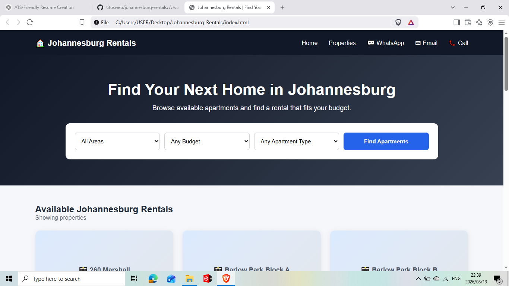
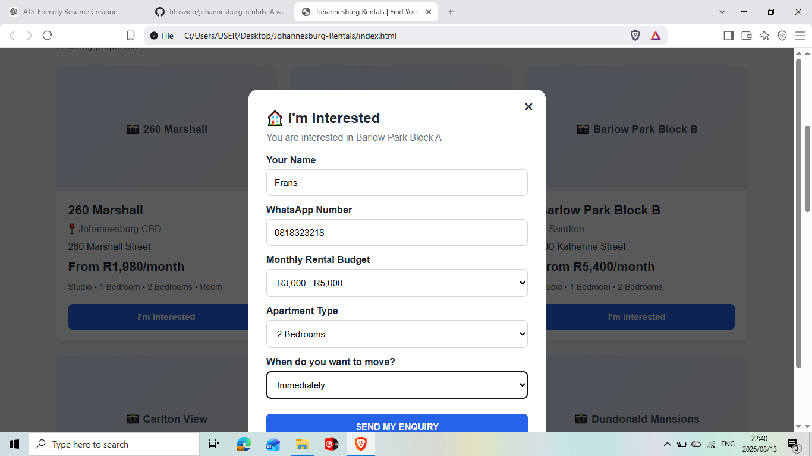
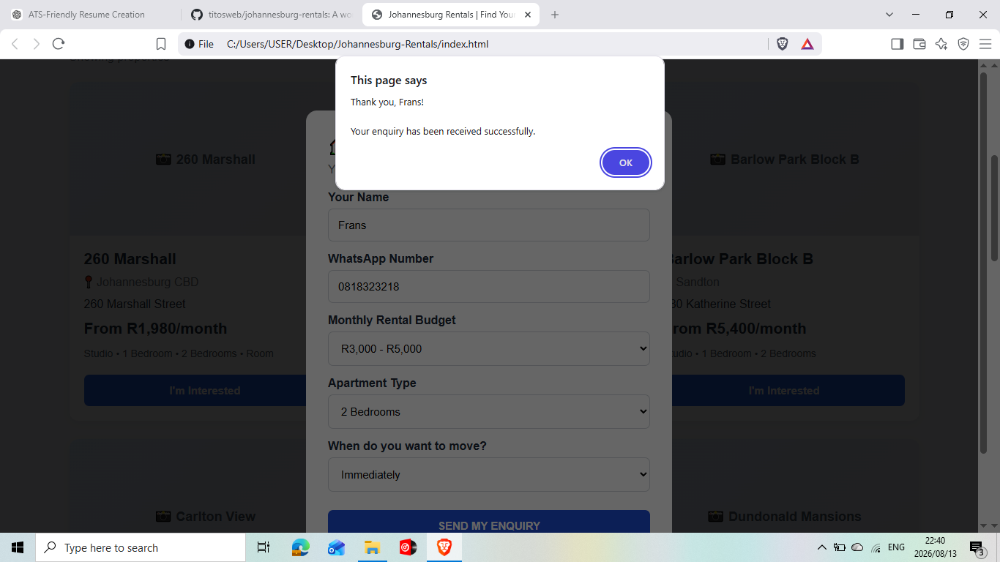
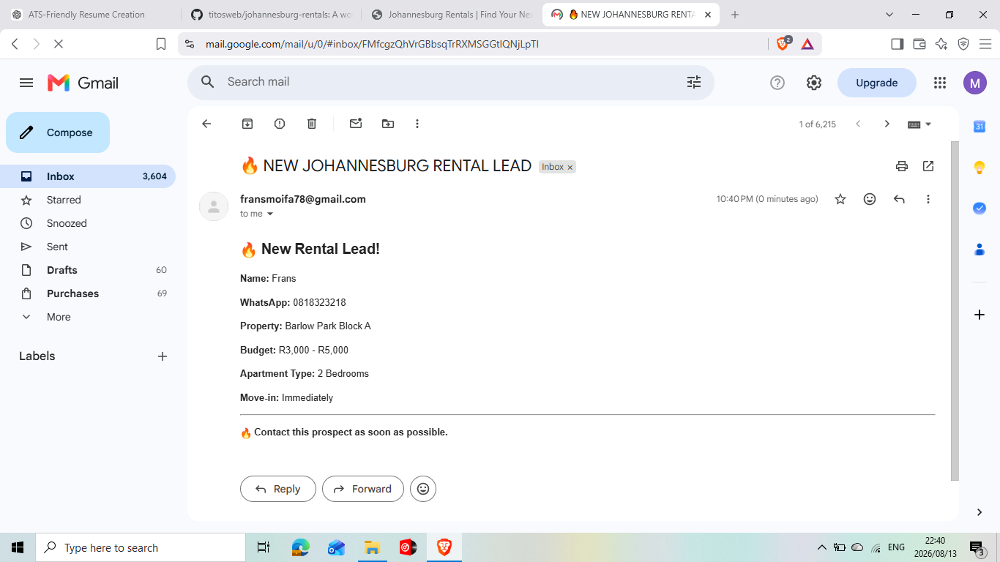

# 🏠 Johannesburg Rentals

> 🚧 Project Status: Work in Progress

Johannesburg Rentals is a property rental web application currently under development. The platform is designed to help prospective tenants browse available rental properties, filter properties according to their preferences and submit enquiries for properties they are interested in.

The project demonstrates practical front-end development, JavaScript functionality, form handling, email notifications and data management.

---

## 🌐 Project Overview

Johannesburg Rentals provides a simple interface where users can:

- Browse available rental properties
- View property locations and rental prices
- Filter properties by area
- Filter properties by budget
- Filter properties by apartment type
- Submit an enquiry for a selected property
- Provide their contact details and rental preferences
- Receive confirmation that their enquiry was submitted

The enquiry workflow is designed to capture useful information from potential tenants so that the property enquiry can be followed up efficiently.

---

## ⚙️ How the Enquiry System Works

The website includes an **"I'm Interested"** feature attached to rental properties.

When a user selects this option, an enquiry form appears requesting information such as:

- Name
- WhatsApp number
- Monthly rental budget
- Apartment type
- Preferred move-in period
- Selected property

After the user submits the enquiry, the system confirms that the enquiry has been received.

The enquiry information is then used to notify the property administrator so that the potential tenant can be contacted.

---

## 📧 Email Notification

The website includes an email notification workflow for new rental leads.

When an enquiry is submitted, an email notification is generated containing important lead information, including:

- Prospective tenant name
- WhatsApp number
- Property of interest
- Rental budget
- Apartment type
- Preferred move-in date

This allows the administrator to quickly identify new rental leads and follow up with interested clients.

---

## 📊 Google Sheets Lead Tracking

The project also incorporates Google Sheets as a simple lead-management and record-keeping solution.

Rental enquiries can be captured and organised in a structured spreadsheet, allowing the administrator to maintain a record of prospective tenants and their requirements.

The captured information can be used to track:

| Information | Purpose |
|---|---|
| Name | Identify the prospective tenant |
| WhatsApp | Contact the prospective tenant |
| Property | Identify the property of interest |
| Budget | Understand the tenant's rental range |
| Apartment Type | Understand the tenant's requirements |
| Move-in Date | Determine urgency and availability |

This provides a simple way of moving from a website enquiry to an organised lead-management process.

---

## 🔎 Property Search & Filtering

The website includes filtering functionality designed to make it easier for users to find suitable properties.

Users can search according to:

- Area
- Rental budget
- Apartment type

The filtering functionality is implemented using JavaScript.

---

## 🏗️ Current Functionality

### Property Listings

The website displays rental properties with information such as:

- Property name
- Location
- Address
- Monthly rental price
- Available apartment types

### Search & Filtering

Users can narrow down available properties using the available search filters.

### Enquiry Form

Users can select a property and submit their requirements through the enquiry form.

### Enquiry Confirmation

After submitting an enquiry, the website provides confirmation that the enquiry has been received.

### Email Notification

New rental enquiries can trigger an email notification containing the lead information.

### Lead Tracking

Google Sheets can be used to maintain an organised record of enquiries and prospective tenants.

---

## 🖥️ Screenshots

### Homepage

### Property Enquiry

### Enquiry Confirmation

### Email Notification

---

## 🛠️ Technologies Used

- HTML5
- CSS3
- JavaScript
- Google Sheets
- GitHub

---

## 🤖 AI-Assisted Development

AI tools, including ChatGPT, were used as a development and learning assistant throughout the project.

AI was used to assist with:

- Understanding HTML, CSS and JavaScript
- Debugging and troubleshooting
- Explaining programming concepts
- Improving website structure
- Developing functionality
- Identifying and resolving errors
- Improving user experience
- Generating ideas for additional features
- Reviewing and refining code
- Learning how different components work together

The project is continuously reviewed, tested and modified during development.

---

## 📚 Skills Demonstrated

This project demonstrates practical exposure to:

- Front-end web development
- HTML
- CSS
- JavaScript
- DOM manipulation
- Form handling
- User input validation
- Search and filtering
- Email-based notifications
- Data collection
- Google Sheets integration
- Git and GitHub
- Debugging
- Problem solving
- AI-assisted development
- User experience design

---

## 🚧 Current Development

Johannesburg Rentals is still a work in progress.

Future improvements include:

- Improved property search
- Advanced filtering
- Individual property detail pages
- Improved mobile responsiveness
- Backend/database integration
- Improved lead management
- Property availability management
- Additional automation
- Improved administration functionality

---

## 🎯 Project Goal

The long-term goal is to develop Johannesburg Rentals into a more complete rental platform that can connect prospective tenants with available properties while providing a simple system for managing rental enquiries and leads.

---

**Project:** Johannesburg Rentals  
**Developer:** Frans Phala  
**Status:** 🚧 Work in Progress
